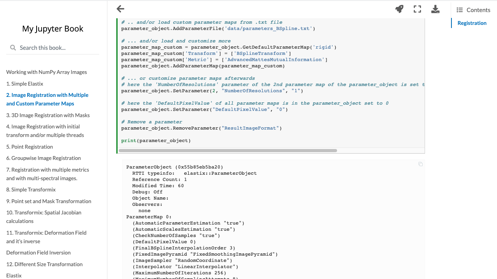

# nbmake [Under Construction]
[](https://codecov.io/gh/treebeardtech/nbmake)
[](https://badge.fury.io/py/nbmake)

Pytest plugin for testing notebooks

## Functionality

1. Executes notebooks using pytest and nbclient, allowing parallel notebook testing
2. Lets you automate release processes from your laptop or in the cloud
3. Optionally builds an HTML report using [jupyter-book](https://github.com/executablebooks/jupyter-book) of the test run which can be uploaded to hosting providers such as Netlify.

See [docs](https://treebeardtech.github.io/nbmake) to get started.

### HTML Report Example




## Developing

### Install local package
```
poetry install -E html
```

### Activate shell
```
poetry shell
```

### Run static checks
```
pre-commit run --all-files
pre-commit install
```

### Run tests
```
pytest
```

