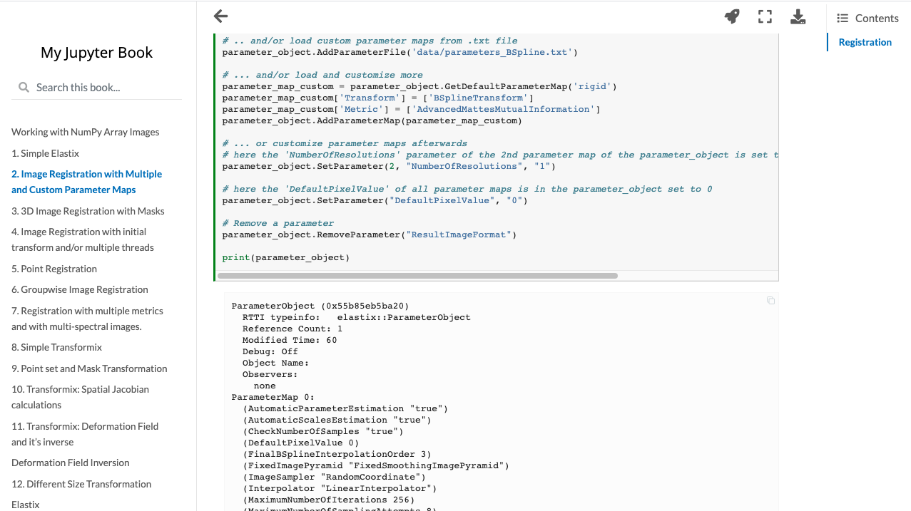

---
jupytext:
  text_representation:
    format_name: myst
kernelspec:
  display_name: Python 3
  name: python3
---

# nbmake

nbmake tests notebook documentation and is designed for notebooks which are non-deterministic.

Despite being a pytest plugin, nbmake is kernel agnostic. It supports any language.


## Quickstart

```bash
pip install pytest nbmake
pytest --nbmake
```

### Output
```
========================================================================================== test session starts ==========================================================================================
platform darwin -- Python 3.7.6, pytest-6.1.2, py-1.9.0, pluggy-0.13.1
rootdir: /Users/asdf/git/treebeardtech/nbmake, configfile: pytest.ini
plugins: nbmake-0.0.1, xdist-2.1.0, cov-2.10.1, forked-1.3.0
collected 1 item

landing-page.ipynb .                                                                                                                                                                              [100%]

=========================================================================================== 1 passed in 1.56s ===========================================================================================
```
## Command Line Options

Using the following options you can control how notebooks are executed, and configure CI pipelines

```{code-cell}
---
cellmetadatakey: val1
---
!pytest -h | grep -A6 'notebook testing'
```

## Run Only Against IPYNB Files

```
pytest --nbmake **/*ipynb
```

## Create an HTML Report

To view outputs executed remotely, install jupyter-book:
```
pip install pytest 'nbmake[html]'
```

Then specify a path:
```
pytest --nbmake --path-output=.
```

### Output
```
========================================================================================== test session starts ==========================================================================================
platform darwin -- Python 3.7.6, pytest-6.1.2, py-1.9.0, pluggy-0.13.1
rootdir: /Users/asdf/git/treebeardtech/nbmake, configfile: pytest.ini
plugins: nbmake-0.0.1, xdist-2.1.0, cov-2.10.1, forked-1.3.0
collected 1 item

landing-page.ipynb .                                                                                                                                                                              [100%]


2020-12-11 11:10:48 nbmake building test report at:

  file:///Users/asdf/git/treebeardtech/nbmake/docs/_build/html/index.html

2020-12-11 11:10:50 done.

=========================================================================================== 1 passed in 4.26s ===========================================================================================
```

The report contains only the stripped out and executed notebooks


## Run and upload report on GitHub Actions using Netlify

```yaml
    - run: pip install pytest 'nbmake[html]'
    - run: |
        pytest --nbmake --path-output=.
    - if: failure()
      run: |
        netlify deploy --dir=_build/html --auth=${{ secrets.NETLIFY_TOKEN }} --site=${{ secrets.NETLIFY_SITE_API_ID }}
```
```
...
- Waiting for deploy to go live...
✔ Deploy is live!

Logs:              https://app.netlify.com/sites/festive-payne-ce084c/deploys/5fcf58ec72dc52a440dffcd7
Website Draft URL: https://5fcf58ec72dc52a440dffcd7--festive-payne-ce084c.netlify.app
```

Note you can also run the tests using [nbmake-action](https://github.com/treebeardtech/treebeard) for this.

## Disable Nbmake

Implicitly:
```
pytest
```

Explicitly:
```
pytest -p no:nbmake
```

## Allow errors and Configure Cell Timeouts

nbmake is designed to compatible with jupyter book config (placed in notebook `metadata`, not the global config.yml)

See [jupyter book docs](https://jupyterbook.org/content/execute.html?highlight=allow_error#dealing-with-code-that-raises-errors)

## Parallelisation

Parallelisation with xdist is experimental upon initial release, but you can try it out:
```
pip install pytest-xdist

pytest --nbmake -n=auto
```

It is also possible to parallelise at a CI-level using strategies, see [example](https://github.com/LabForComputationalVision/plenoptic/blob/master/.github/workflows/treebeard.yml)

### Build Jupyter Books Faster

Using xdist and the `--overwrite` flag let you build a large jupyter book repo faster:

```
pytest --nbmake --overwrite -n=auto examples
jb build examples
```

## Advice on Usage

nbmake is best used in a scenario where you use the ipynb files only for development. Consumption of notebooks is primarily done via a docs site, built through jupyter book, nbsphinx, or some other means. If using one of these tools, you are able to write assertion code in cells which will be [hidden from readers](https://jupyterbook.org/interactive/hiding.html).

### Pre-commit

Treating notebooks like source files lets you keep your repo minimal. Some tools, such as plotly may drop several megabytes of javascript in your output cells, as a result, stripping out notebooks on pre-commit is advisable:

```
# .pre-commit-config.yaml
repos:
  - repo: https://github.com/kynan/nbstripout
    rev: master
    hooks:
      - id: nbstripout
```

See https://pre-commit.com/ for more...

## Contributing

Feedback is the best contribution you can make as a user of this tool. Join the [Slack channel](https://join.slack.com/t/treebeard-entmoot/shared_invite/zt-jyvuqted-xBjnbvlfcu5P2ltBvn1~mg) and bug me (Alex), and raise an [issue](https://github.com/treebeardtech/nbmake/issues), even if you think you are the only person with this problem.

## See Also:

* [nbmake action](https://github.com/treebeardtech/treebeard)
* [pytest](https://pytest.org/)
* [jupyter book](https://github.com/executablebooks/jupyter-book)
* [jupyter cache](https://github.com/executablebooks/jupyter-cache)
* [MyST-NB](https://github.com/executablebooks/MyST-NB)
